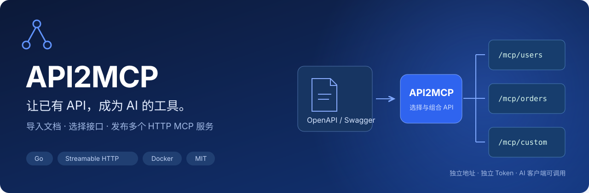
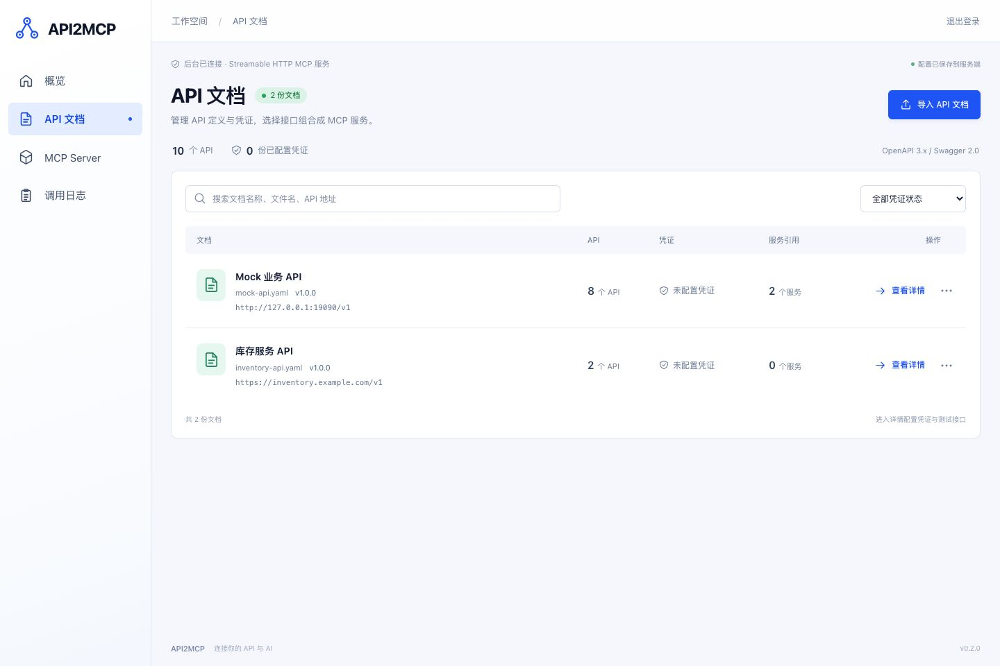
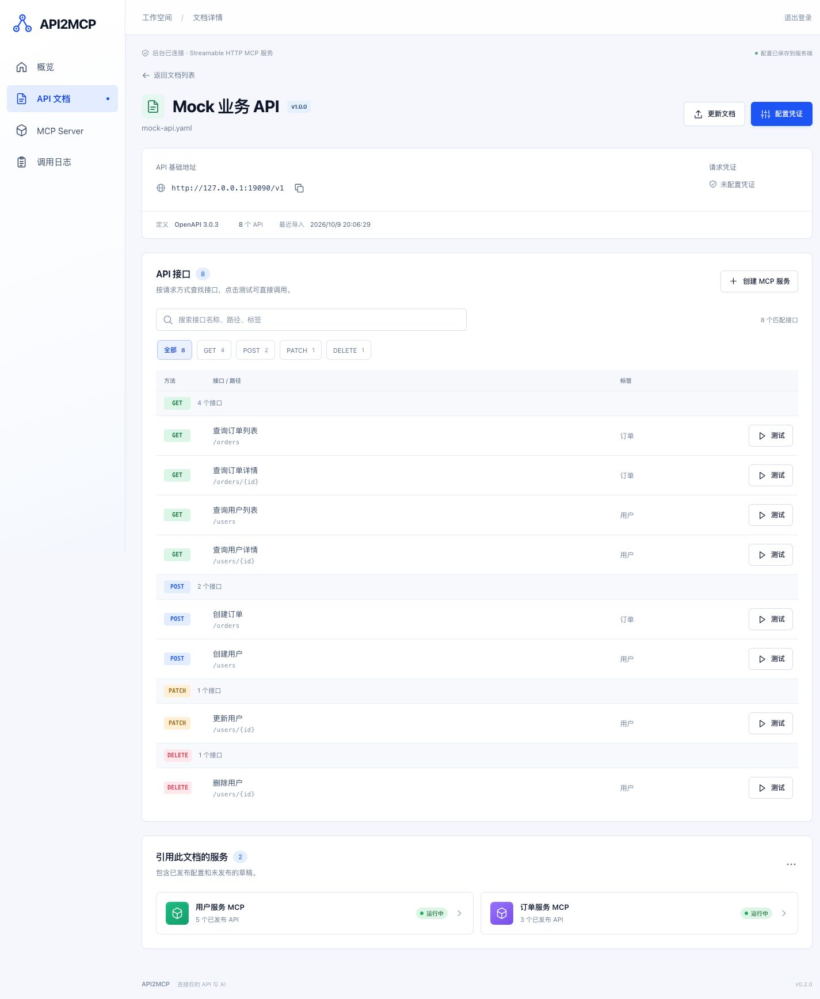
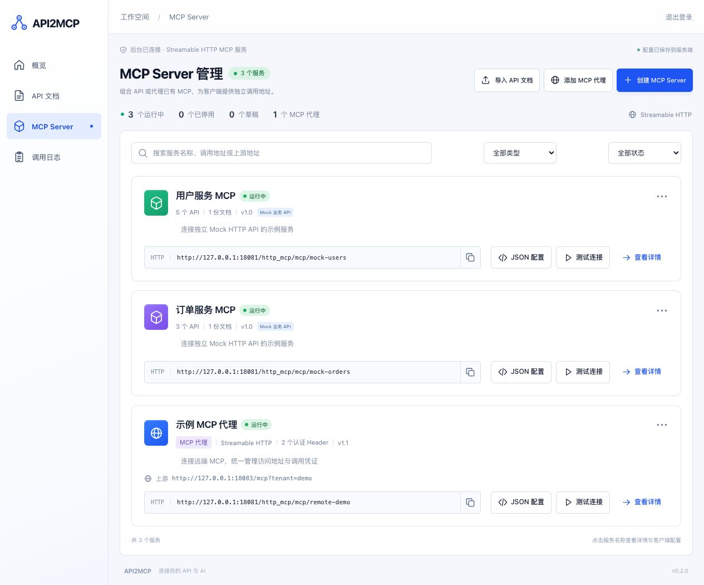

<p align="center"></p>

# API2MCP

**导入 API 文档生成 HTTP MCP 服务，也能代理已有的 MCP 地址。**

一个可以自托管的 API → MCP 管理平台。Go 后端与原生 HTML / CSS / JavaScript 后台打包在同一个二进制中，通过 Docker 部署。已有 API 保持原来的实现，AI 客户端通过 Streamable HTTP 调用选中的接口。

[](https://github.com/xyzphp/api2mcp/actions/workflows/ci.yml)
[](https://github.com/xyzphp/api2mcp/actions/workflows/release.yml)
[](go.mod)
[](LICENSE)

[快速开始](#快速开始) · [使用流程](#使用流程) · [项目文档](docs/README.md) · [部署指南](docs/deployment.md) · [Release 与镜像](docs/github-actions.md)

## 可以做什么

| 能力 | 说明 |
| --- | --- |
| 文档管理 | OpenAPI 3.0 / 3.1、Swagger 2.0，支持 JSON / YAML 文件、拖拽、粘贴、URL 导入与手动更新 |
| API 调试 | 类似 Postman，编辑 Path / Query / Header / Cookie / JSON / 表单，查看状态、耗时、响应与脱敏后的实际请求 |
| 多 MCP 服务 | 跨文档组合 API；独立地址、调用 Token、草稿、发布、更新、启停与复制 |
| MCP 代理 | 填写已有 Streamable HTTP MCP URL，代理工具 / 资源 / 提示词，保留会话与流式响应；支持上游认证 Header 与客户端覆盖 |
| 方法分组 | 按 GET、POST、PUT、PATCH、DELETE 等方式筛选，支持按组和当前结果批量勾选 |
| 灵活凭证 | Basic / Bearer、自定义 Header / Query / Body / Cookie，支持嵌套 JSON、批量录入和逐项启停 |
| 客户端配置 | 预览并复制 MCP JSON，自动带入共同 Header 凭证；调用者通过 Header 覆盖凭证与 `base_url` |
| 持久化 | SQLite + AES-256-GCM 工作空间加密，调用日志保留最近 1000 条 |
| 自托管 | 单管理员 Token 登录，非 root Docker 镜像、健康检查、局域网和 Nginx 子路径部署 |

## 快速开始

需要 **Docker / Docker Compose v2、Go 1.25+、Make**。默认只绑定本机回环地址。

```sh
git clone https://github.com/xyzphp/api2mcp.git
cd api2mcp
make init
make up
```

打开 **[http://localhost:8080](http://localhost:8080)**，使用本机 `.env` 中的 `ADMIN_TOKEN` 登录。`make init` 随机生成登录 Token 和加密密钥；不会覆盖已有 `.env`。

首次空数据库会导入 Mock 文档并创建两个可调用服务：

- `mock-users`：用户查询、创建、更新和删除。
- `mock-orders`：订单查询和创建。

```sh
make smoke   # 通过官方 MCP Go SDK 验证真实只读调用，需要启用内置 Mock
make logs    # 查看日志
make down    # 停止服务，保留数据卷
```

管理数据保存在 `app-data` 数据卷；Mock 业务数据保存在内存中。备份数据库时需同时保留原 `ENCRYPTION_KEY`。不要对需要保留的数据执行 `down -v`。

已有 Release 后，可按[镜像部署说明](docs/deployment.md#使用-release-镜像)使用 GHCR 预构建的 amd64 / arm64 镜像。源码构建始终可用。

## 使用流程

1. **导入文档**：上传、粘贴 OpenAPI / Swagger，或填写文档 URL。
2. **配置并测试 API**：进入文档详情，配置基础地址和凭证，按方法筛选并测试接口。
3. **创建 MCP 服务**：选择一份或多份文档中的 API，填写名称与服务标识，发布。
4. **接入客户端**：在服务详情复制 JSON，放入支持 HTTP MCP 的客户端。
5. **维护**：手动更新文档或调整接口选择，发布服务更新；客户端重新读取工具列表。

### 管理后台

API 文档采用全宽列表与独立详情页，列表支持搜索和凭证状态筛选；详情集中展示文档信息、方法分组、接口调试和引用服务。





### 架构


同一 Go 进程提供管理页面、管理 API 和多个 `/mcp/{slug}` 端点。管理登录会话与 MCP 调用 Token 分开校验；每个端点仅暴露选中的工具。项目使用[官方 MCP Go SDK](https://github.com/modelcontextprotocol/go-sdk)。

### MCP 配置示例

```json
{
  "mcpServers": {
    "my-service": {
      "type": "http",
      "url": "http://localhost:8080/mcp/my-service?token=<MCP_TOKEN>",
      "headers": {
        "base_url": "https://api.example.com/v1",
        "Authorization": "Bearer <UPSTREAM_TOKEN>",
        "X-Tenant-ID": "demo"
      }
    }
  }
}
```

`token` 验证 MCP 服务访问权限；普通 `headers` 透传给上游，优先于后台凭证。`base_url` 由代理识别，用于覆盖 API 基础地址，不会转发给上游。未设置的凭证使用后台配置，Query / Body 凭证按文档注入。详见[凭证与客户端配置](docs/credentials.md)。

从局域网 IP 登录时生成局域网 MCP 地址，从 HTTPS 域名登录时生成域名地址；配置 `BASE_PATH` 后自动带上路径前缀。

### 代理已有 MCP

在 **MCP Server → 添加 MCP 代理** 填写上游 URL 和可选认证 Header，发布后即可使用独立地址。在详情测试连接、查看工具并复制 JSON。无需导入 API 文档，支持 Streamable HTTP 的 GET / POST / DELETE、JSON / SSE 与有状态会话。客户端 Header 优先于后台配置，详见 [MCP 代理说明](docs/mcp-proxy.md)。



## 开发与发布

```sh
make dev     # 监听源码，自动重建并重启 Docker 服务
make test    # Go race 测试 + 前端契约测试，需要 Node.js 22+
go vet ./...
```

每次分支提交 / PR 运行测试并验证 Docker 镜像启动。**发布 GitHub Release 时**，流水线自动构建并推送：

- `ghcr.io/xyzphp/api2mcp:<release-tag>`
- `ghcr.io/xyzphp/api2mcp-mock:<release-tag>`

支持 `linux/amd64` 和 `linux/arm64`；正式 Release 更新 `latest`，预发布版本保留独立标签。首次发布 GHCR 包后需检查包的公开可见性。详见[流水线与发布](docs/github-actions.md)。

## 文档导航

| 文档 | 内容 |
| --- | --- |
| [架构与数据模型](docs/architecture.md) | Go 模块、调用链、服务与文档关系、存储方式 |
| [配置说明](docs/configuration.md) | 环境变量、端口、Token、加密密钥、构建代理 |
| [Docker / Nginx 部署](docs/deployment.md) | 源码构建、Release 镜像、局域网、子路径、备份 |
| [凭证与 MCP 客户端](docs/credentials.md) | API 调试、参数格式、Header 透传和优先级 |
| [MCP 代理](docs/mcp-proxy.md) | 上游 URL、认证、流式转发、会话与客户端覆盖 |
| [管理 HTTP API](docs/http-api.md) | 登录、文档、服务、测试和日志接口 |
| [本地开发](docs/development.md) | 目录结构、验证命令、UI 审查、调试方法 |
| [GitHub Actions](docs/github-actions.md) | 提交验证、镜像发布、手动构建与权限 |
| [能力边界](docs/limits.md) | 格式支持、容量、协议与当前限制 |

## 当前范围

面向单管理员、单进程的自托管场景。当前文档更新需要手动触发，支持结构化 OpenAPI / Swagger，不自动解析 Markdown / PDF。暂不提供多用户 RBAC、OAuth 授权服务器、动态刷新凭证、multipart 文件上传或高可用集群。完整范围见[能力边界](docs/limits.md)。

上游允许任意网络可达的 HTTP / HTTPS 地址，包括局域网和回环地址，无需白名单。具有 MCP Token 的调用者能使用开放工具，并可通过 `base_url` 指定上游；应将后台和调用 Token 交给可信使用者。部署注意事项见[安全说明](SECURITY.md)。

## 许可证

[MIT](LICENSE) © 2026 xyzphp。欢迎提交 Issue 和 PR，见[贡献指南](CONTRIBUTING.md)。
