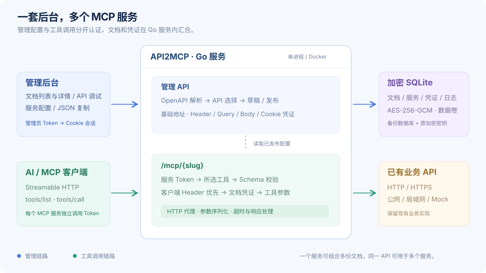

# 架构与数据模型

## 运行单元

管理页面、管理 HTTP API 与 MCP 端点由同一个 Go 服务提供。原生 HTML / CSS / JavaScript 使用 `go:embed` 嵌入二进制；线上无需 Node.js、前端构建服务或单独的静态资源服务器。

Compose 默认启动两个容器：

| 容器 | 职责 | 数据 |
| --- | --- | --- |
| `api2mcp` | 管理后台、认证、解析、MCP 与上游代理 | 加密 SQLite 数据卷 |
| `mock-api` | 本地演示用用户 / 订单 API | 内存，重启恢复 |

Docker 使用纯 Go、多阶段编译和 scratch 运行镜像，默认以 UID / GID 65532 运行。镜像内包含 CA 证书，支持 HTTPS 上游。amd64 / arm64 镜像通过 Go 交叉编译生成。

## 调用链

**管理链路**：浏览器 → Token 登录 → HttpOnly 会话 Cookie → 管理 API → 文档解析 / 草稿发布 / 凭证更新 → SQLite。

**工具链路**：AI 客户端 → `/mcp/{slug}?token=...` → 独立服务 Token 校验 → 所选 API 的工具与 Schema → 参数验证 / 凭证合并 → 上游 HTTP API → MCP 工具响应。

MCP 使用官方 Go SDK 的无状态 Streamable HTTP，并启用 JSON 响应。每次请求从当前工作空间快照构造所选工具；草稿不影响已发布接口。服务停用返回 503，未发布草稿不提供调用入口。

**MCP 代理链路**：AI 客户端 → `/mcp/{slug}?token=...` → 服务 Token / 状态校验 → 客户端 Header 与已发布代理配置合并 → 上游完整 MCP 端点。代理使用 Go HTTP ReverseProxy，不重建工具或会话；GET / POST / DELETE、JSON / SSE、资源和提示词等消息直接透传。详见 [MCP 代理](mcp-proxy.md)。

## 数据关系

| 对象 | 主要字段 | 关系 |
| --- | --- | --- |
| Document | 名称、版本、基础地址、原始来源、凭证、Operations | 一份文档包含多个 Operation |
| Operation | HTTP 方法、路径、参数、Body、InputSchema、ToolName | 由服务引用内部 ID |
| Server | type、名称、slug、operationIds、proxy、状态、Token、版本、draft | api 组合文档接口；proxy 连接已有 MCP URL |
| Credential | 预设认证、entries、bodyFormat | 作用于整份文档 |
| CallLog | 服务、操作、状态、耗时、时间 | 最多保留 1000 条 |

更新文档时按“HTTP 方法 + 路径”保留接口 ID 与已有凭证，引用它的发布服务版本递增。被服务或草稿引用的接口不可直接删除；同理，被引用的文档必须先解除引用才能删除。

服务发布时校验唯一 slug 和接口集合。已有发布服务可保存待发布草稿；发布更新后生效，调用地址和 Token 保持不变。Token 只在首次发布或显式重置时改变。

## 存储与会话

SQLite 中以 AES-256-GCM 加密整个工作空间对象，包含 API 凭证、MCP Token 与配置。每次修改在进程锁下原子提交；进程间文件锁阻止多个实例打开同一数据库。备份需要数据库和原 `ENCRYPTION_KEY`。

登录会话保存在内存，默认 8 小时，重启后失效。业务配置和 MCP Token 持久化。管理工作空间接口隐藏上游 Header 凭证值；`client-headers` 和 `proxy-config` 接口仅供已登录管理员导出和编辑相关 Header 值。代理完整 URL 对管理员可见，包括其中的查询参数。

## 模块索引

| 模块 | 代码 |
| --- | --- |
| 程序启动 / 关闭 / 健康检查 | `cmd/api2mcp/` |
| 配置 / HTTP 路由 | `internal/platform/config.go`、`app.go` |
| 管理认证 | `auth.go` |
| 文档与服务管理 | `handlers.go`、`openapi.go` |
| MCP 协议 / 工具注册 | `mcp.go` |
| HTTP MCP 透明代理 | `mcp_reverse_proxy.go` |
| 请求构造 / 响应 / 错误分类 | `proxy.go` |
| 凭证 / 客户端 Header | `credentials.go`、`client_credentials.go`、`client_headers.go`、`mcp_proxy_headers.go` |
| API 调试 | `api_test_handler.go` |
| 加密与持久化 | `store.go`、`model.go` |
| 前端路由 / 页面 / 弹窗 | `assets/app.js` |
| 前端参数与配置契约 | `assets/core.js` |

## 扩展方向

当前使用单进程、单工作空间，适合个人或小团队自托管。扩展多人权限、任务调度或高可用时，应先拆分数据模型和会话存储，再考虑多实例部署；不能直接让多个容器共享同一 SQLite 卷。
