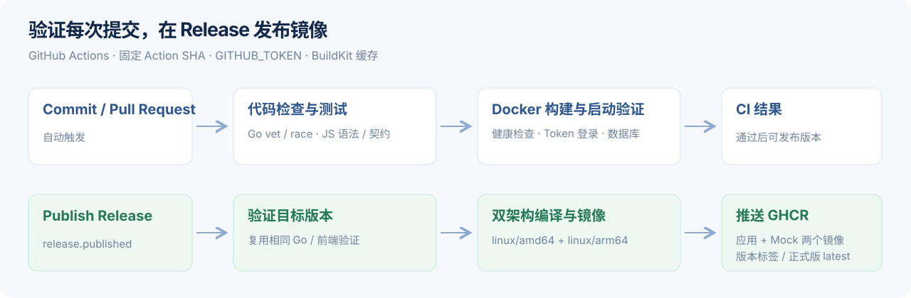

# GitHub Actions 与镜像发布



## 触发规则

| 事件 | 检查 | 镜像 |
| --- | --- | --- |
| 提交到任意分支 | 格式、vet、Go race 测试、JS 语法与契约、容器启动 / 登录 | 构建验证，不推送 |
| Pull Request | 同上 | 构建验证，不推送 |
| 发布 GitHub Release | 重新验证该版本 | 推送 amd64 / arm64 的应用和 Mock 镜像 |
| 手动运行 CI | 同提交检查 | 不推送 |
| 手动运行 Docker release | 重新验证选择的 ref | 默认只构建；勾选 `publish` 才推送 |

工作流分为 `verify.yml`（复用验证）、`ci.yml`（提交验证）、`release.yml`（发布）。第三方 Actions 固定到完整 commit SHA，Dependabot 每月检查更新。

## 发布版本

1. 确保目标提交的 CI 成功，更新 `CHANGELOG.md`。
2. 在 GitHub Releases 选择 **Draft a new release**，创建例如 `v0.2.0` 的标签并选择目标提交。
3. 填写版本说明并点击 **Publish release**。
4. 到 Actions 查看 **Docker release**；成功后检查 Packages 中两个镜像。

创建草稿 Release 或单独推送 Git 标签不会触发镜像发布；触发事件是 `release.published`。预发布版本也触发构建，但不会更新 `latest`。若事后编辑 Release 内容不会自动重建，需手动运行工作流。

正式版示例：

```text
ghcr.io/xyzphp/api2mcp:v0.2.0
ghcr.io/xyzphp/api2mcp:0.2.0
ghcr.io/xyzphp/api2mcp:latest

ghcr.io/xyzphp/api2mcp-mock:v0.2.0
ghcr.io/xyzphp/api2mcp-mock:0.2.0
ghcr.io/xyzphp/api2mcp-mock:latest
```

Dockerfile 利用 Go 交叉编译构建 `linux/amd64`、`linux/arm64`，无需在模拟器中编译 Go。BuildKit 使用 GitHub Actions 缓存加快后续构建。正式版应使用递增版本号，避免重新使用已有版本标签。

## 权限与配置

无需 Docker Hub 账号或额外 PAT。发布任务使用 GitHub 提供的 `GITHUB_TOKEN`，只在该任务申请 `packages: write`；验证任务仅需 `contents: read`。不读取本机 `.env` 或业务数据。

首次推送 GHCR 包后，检查包的 **Package settings → Change visibility → Public**。公开仓库与包的可见性并不等价。匿名拉取须包本身设为 Public。工作流的 OCI 标签会关联仓库，已有同名包时还需授予仓库 Actions 写入权限。

如果 Actions 被账号或组织禁用，需在仓库 **Settings → Actions → General** 允许本仓库使用相应 Actions。仓库工作流已声明最小任务权限，无需将所有工作流默认改成读写。

## 无 Release 验证

在 Actions 打开 **Docker release → Run workflow**，选择分支，`tag` 填 `edge`，`publish` 保持关闭。这会运行完整双架构构建，用于检验配置；不会创建 Release 或推送镜像。

CLI 等价命令：

```sh
gh workflow run release.yml -f tag=edge -F publish=false
gh run list --workflow release.yml
```

## 排错

| 错误 | 处理 |
| --- | --- |
| GHCR `denied` / 403 | 检查包的 Actions access、组织策略、任务 `packages: write` |
| 镜像匿名拉取失败 | 检查 GHCR 包是否 Public，以及对应标签是否已经成功发布 |
| 未触发发布 | 确认点击 Publish release，而不是保存草稿或只推 tag |
| 构建下载依赖失败 | 查看 Go 模块源和 Actions 网络；不要写入个人代理或密钥 |
| Docker tag 无效 | 标签应使用 Docker 允许的字母、数字、下划线、点和连字符，推荐 SemVer |

参考 [Docker 的 GitHub Actions 多平台构建](https://docs.docker.com/build/ci/github-actions/multi-platform/)、[GitHub 的工作流触发规则](https://docs.github.com/en/actions/how-tos/write-workflows/choose-when-workflows-run/trigger-a-workflow)、[GHCR 权限与可见性](https://docs.github.com/en/packages/working-with-a-github-packages-registry/working-with-the-container-registry)。
